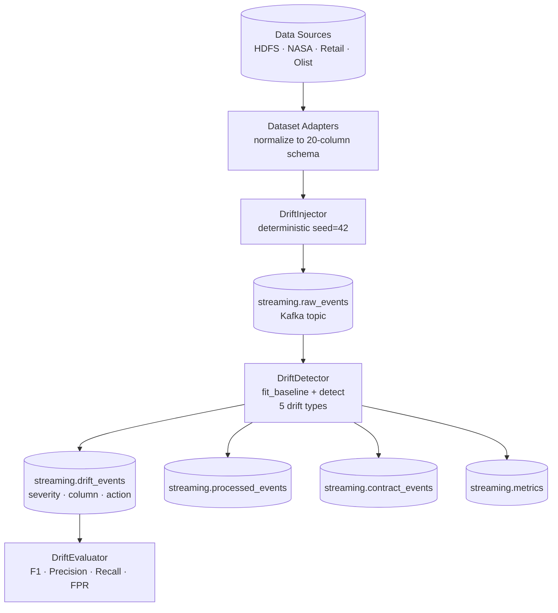

# Architecture

## System Overview

The pipeline is built around a stateful micro-batch drift detector that processes event
streams from Apache Kafka and emits structured drift events to dedicated output topics.

```
┌─────────────────────────────────────────────────────────────────┐
│                        Data Sources                             │
│   LogHub HDFS · NASA HTTP · Online Retail II · Olist           │
└──────────────────────────┬──────────────────────────────────────┘
                           │  Dataset Adapters
                           │  (normalise to 20-column schema)
                           ▼
┌─────────────────────────────────────────────────────────────────┐
│                      DriftInjector                              │
│   Applies domain-specific perturbations at known windows        │
│   Detector is blind to injection schedule                       │
└──────────────────────────┬──────────────────────────────────────┘
                           │  KafkaProducer / CSVStreamSource
                           ▼
              ┌────────────────────────┐
              │  streaming.raw_events  │  Kafka topic
              └────────────┬───────────┘
                           │  StreamingExecutor (micro-batch consumer)
                           ▼
┌─────────────────────────────────────────────────────────────────┐
│                      DriftDetector                              │
│                                                                 │
│  fit_baseline(first_batch)                                      │
│  detect(batch) → List[DriftEvent]                               │
│                                                                 │
│  ├── schema_rename    (column set diff)                         │
│  ├── type_drift       (dtype incompatibility)                   │
│  ├── missingness_drift (NULL rate jump ≥ threshold)             │
│  ├── value_drift      (unseen category > frequency floor)       │
│  └── distribution_drift (sigma-based / rate-based)              │
└──────────────────────────┬──────────────────────────────────────┘
                           │
          ┌────────────────┼──────────────────────┐
          ▼                ▼                       ▼
  drift_events    contract_events            metrics
  (severity,      (schema pass/fail          (throughput,
   column,         per batch)                 latency,
   action)                                    drift_count)
```

## Component Responsibilities

### `streaming/drift_detector.py` — Core Engine

The `DriftDetector` class is the central component. It:

- Maintains a **statistical baseline** computed on the first batch
- Runs **5 independent drift checks** on each subsequent batch
- Uses **dataset-specific configuration** to avoid false positives
- Emits **structured drift events** with severity, column, and recommended action

Key design decisions are documented in [Calibration.md](Calibration.md).

### `streaming/executor.py` — Execution Layer

Two execution modes:

- `StreamingExecutor` — CSV-based, no Kafka required (for evaluation and demo)
- `KafkaStreamingExecutor` — full Kafka consumer/producer loop

### `adapters/` — Dataset Normalisation

Each adapter transforms a raw dataset CSV into the standard 20-column event schema. This
normalisation layer ensures the detector operates identically regardless of the source format.

### `evaluation/` — Benchmarking Framework

- `DriftInjector` — applies deterministic perturbations at known windows
- `DriftMetrics` — window-level binary classification metrics (F1, Precision, Recall, FPR)
- `kafka_eval.py` — orchestrates full evaluation runs in both standalone and Kafka E2E modes

### `kafka/` — Kafka Utilities

Topic management and diagnostic tooling. Not part of the core detection logic.

## Kafka Topology

```
Producers                    Topics                      Consumers
─────────                    ──────                      ─────────
CSV Adapter    ──►  streaming.raw_events      ──►  DriftDetector
                    streaming.processed_events ──►  Downstream analytics
                    streaming.drift_events     ──►  Alerting / monitoring
                    streaming.contract_events  ──►  Data quality dashboard
                    streaming.metrics          ──►  Observability stack
                    streaming.errors           ──►  Dead-letter handler
```

## Deployment

```
docker compose up -d          # Kafka 3.x + Zookeeper
python kafka/ensure_topics.py # Create all topics
python scripts/eval_kafka_stream.py --kafka
```

For production deployment, replace the local docker-compose with a managed Kafka cluster
(Confluent Cloud, AWS MSK, Azure Event Hubs with Kafka protocol).

---

## Component Diagram


