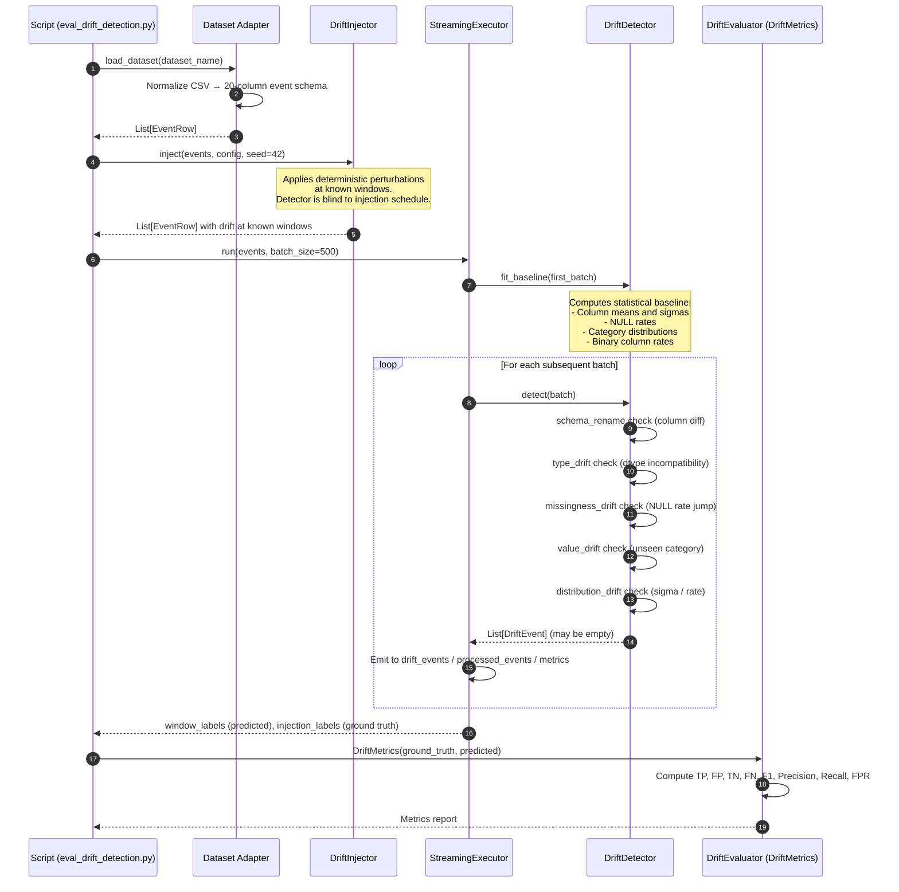
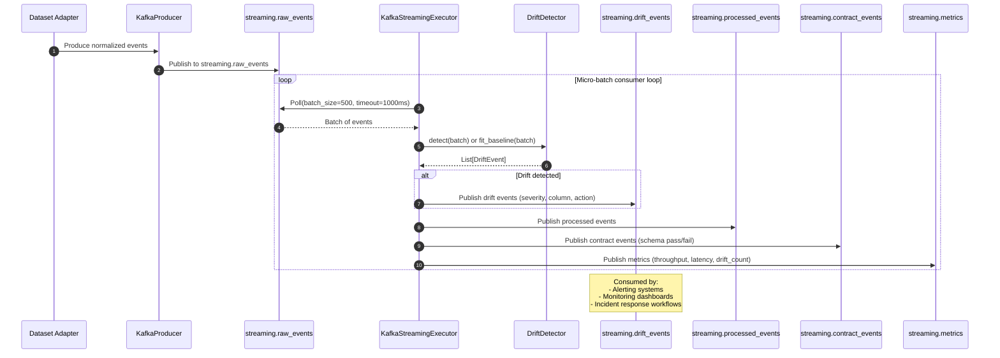
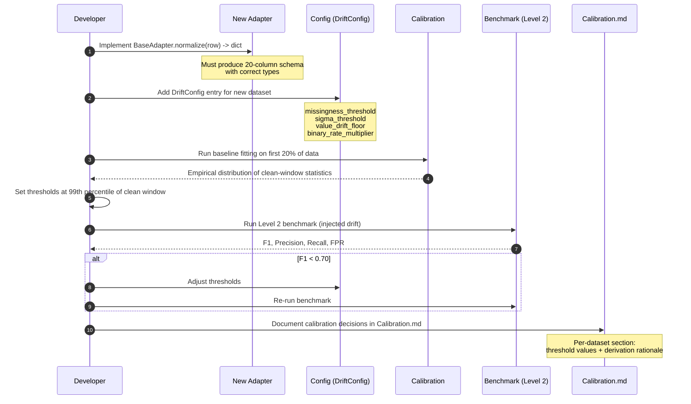

# Sequence Diagrams — Realtime Streaming Pipeline

## CSV-Mode Evaluation Flow

```mermaid
sequenceDiagram
    autonumber
    participant SC as Script (eval_drift_detection.py)
    participant AD as Dataset Adapter
    participant DI as DriftInjector
    participant SE as StreamingExecutor
    participant DD as DriftDetector
    participant EV as DriftEvaluator (DriftMetrics)

    SC->>AD: load_dataset(dataset_name)
    AD->>AD: Normalize CSV → 20-column event schema
    AD-->>SC: List[EventRow]

    SC->>DI: inject(events, config, seed=42)
    Note over DI: Applies deterministic perturbations<br/>at known windows.<br/>Detector is blind to injection schedule.
    DI-->>SC: List[EventRow] with drift at known windows

    SC->>SE: run(events, batch_size=500)
    SE->>DD: fit_baseline(first_batch)
    Note over DD: Computes statistical baseline:<br/>- Column means and sigmas<br/>- NULL rates<br/>- Category distributions<br/>- Binary column rates

    loop For each subsequent batch
        SE->>DD: detect(batch)
        DD->>DD: schema_rename check (column diff)
        DD->>DD: type_drift check (dtype incompatibility)
        DD->>DD: missingness_drift check (NULL rate jump)
        DD->>DD: value_drift check (unseen category)
        DD->>DD: distribution_drift check (sigma / rate)
        DD-->>SE: List[DriftEvent] (may be empty)
        SE->>SE: Emit to drift_events / processed_events / metrics
    end

    SE-->>SC: window_labels (predicted), injection_labels (ground truth)

    SC->>EV: DriftMetrics(ground_truth, predicted)
    EV->>EV: Compute TP, FP, TN, FN, F1, Precision, Recall, FPR
    EV-->>SC: Metrics report
```

---

## Kafka E2E Flow

```mermaid
sequenceDiagram
    autonumber
    participant AD as Dataset Adapter
    participant KP as KafkaProducer
    participant RT as streaming.raw_events
    participant KE as KafkaStreamingExecutor
    participant DD as DriftDetector
    participant DE as streaming.drift_events
    participant PE as streaming.processed_events
    participant CE as streaming.contract_events
    participant ME as streaming.metrics

    AD->>KP: Produce normalized events
    KP->>RT: Publish to streaming.raw_events

    loop Micro-batch consumer loop
        KE->>RT: Poll(batch_size=500, timeout=1000ms)
        RT-->>KE: Batch of events

        KE->>DD: detect(batch) or fit_baseline(batch)
        DD-->>KE: List[DriftEvent]

        alt Drift detected
            KE->>DE: Publish drift events (severity, column, action)
        end

        KE->>PE: Publish processed events
        KE->>CE: Publish contract events (schema pass/fail)
        KE->>ME: Publish metrics (throughput, latency, drift_count)
    end

    Note over DE: Consumed by:<br/>- Alerting systems<br/>- Monitoring dashboards<br/>- Incident response workflows
```

---

## Adding a New Dataset — Developer Flow

```mermaid
sequenceDiagram
    autonumber
    participant DEV as Developer
    participant AD as New Adapter
    participant CF as Config (DriftConfig)
    participant CAL as Calibration
    participant BM as Benchmark (Level 2)
    participant DOC as Calibration.md

    DEV->>AD: Implement BaseAdapter.normalize(row) -> dict
    Note over AD: Must produce 20-column schema<br/>with correct types

    DEV->>CF: Add DriftConfig entry for new dataset
    Note over CF: missingness_threshold<br/>sigma_threshold<br/>value_drift_floor<br/>binary_rate_multiplier

    DEV->>CAL: Run baseline fitting on first 20% of data
    CAL-->>DEV: Empirical distribution of clean-window statistics

    DEV->>DEV: Set thresholds at 99th percentile of clean window
    DEV->>BM: Run Level 2 benchmark (injected drift)
    BM-->>DEV: F1, Precision, Recall, FPR

    alt F1 < 0.70
        DEV->>CF: Adjust thresholds
        DEV->>BM: Re-run benchmark
    end

    DEV->>DOC: Document calibration decisions in Calibration.md
    Note over DOC: Per-dataset section:<br/>threshold values + derivation rationale
```
